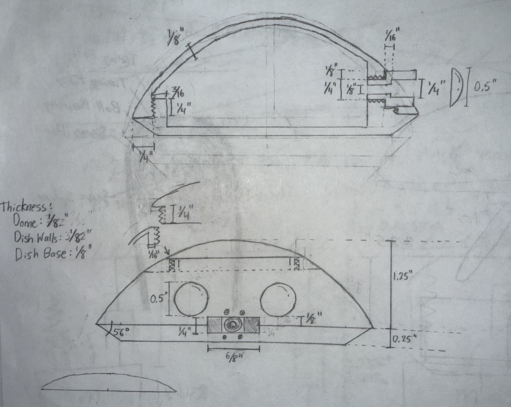

# Electrical system

## Planned system

The existing project description specifies a 12 V motor supply and a 5 V buck converter for
small electronics. The modular wiring approach currently avoids a custom PCB.

| Subsystem | Current information |
| --- | --- |
| Main controller | AITRIP original ESP32 / ESP-WROOM-32 board with USB-C, pending physical verification |
| Operator input | DualShock 4 over Bluetooth Classic using Bluepad32 |
| Wheel actuation | Two BLDC gimbal motors; driver and feedback details need confirmation |
| Leg actuation | Two digital servo hip motors; exact devices need confirmation |
| Balance sensing | IMU model and mounting need confirmation |
| Effects | Lights and sound hardware need confirmation |

This is an existing portfolio concept sketch, not a validated wiring diagram.

## Wiring documentation

Put confirmed wiring diagrams and bills of materials in `hardware/`. Record supply requirements,
connections, and GPIO assignments after identifying the actual hardware.
The diagnostic firmware has no actuator outputs enabled.

## Next steps

Verify the board, sensor, motor drivers, servos, and effects hardware before assigning pins.
See the [setup checklist](setup-status.md) for the USB and wireless checks.
