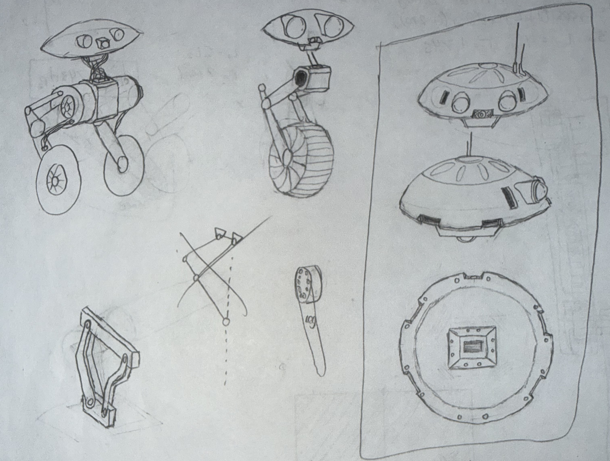
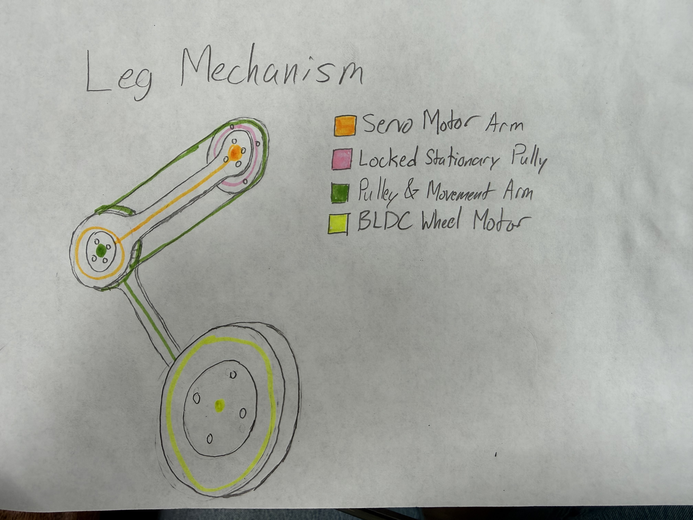
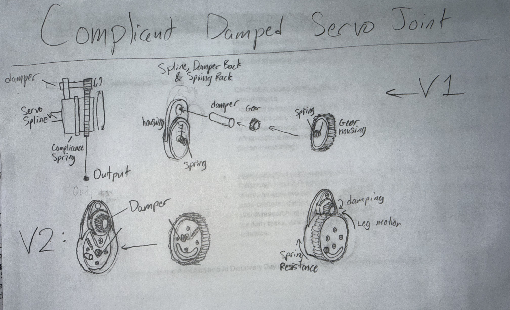

# Mechanical design

## Goal

Build a compact wheeled biped with two servo-driven hips and two BLDC gimbal wheel motors.
The pulley linkage is intended to provide linear vertical foot movement without additional knee motors.
Future motion experiments include banked turning and jumping; these remain goals, not demonstrated capabilities.

## Current concepts

These sketches are copied from the existing portfolio project. They document concepts and should
not be treated as final dimensions or validated mechanisms.

## CAD and build files

The original `CAD/V1 CAD` folder remains the local working area. Selected exports, printable parts,
and assembly drawings belong in `hardware/` when ready to share.

## Next steps

Record dimensions, selected actuators, assembly details, and prototype findings as they are confirmed.
Link new progress photos from the [progress log](progress.md).
